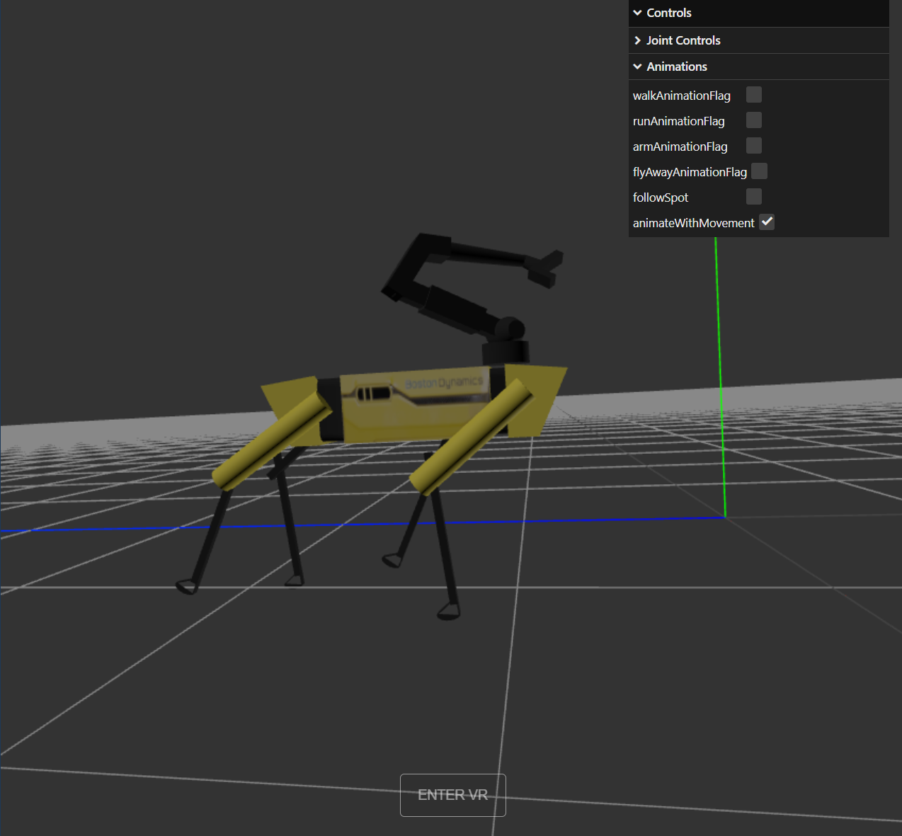
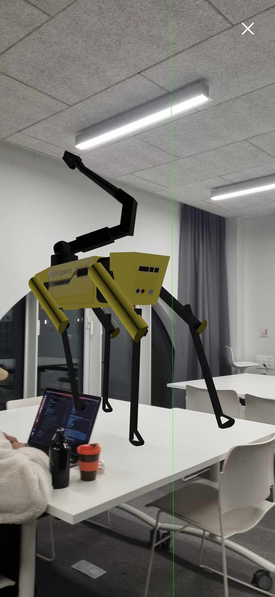

# Robot in THREE.JS

## Description

A simulation of Boston Dynamic's Spot the robot using THREE JS, and other miscellanious scripts for primitives and textures in three.js. Developed as part of the Practical Works 1 of the UJM Computer Graphics Course 2024.

Can be accessed here: [https://septianrazi.github.io/RobotInThree.JS/](https://septianrazi.github.io/RobotInThree.JS/)

## Installation

To run the project, simply run the file using a live server implementation. Extensions to do this are available in VSCode.

## Usage

There are 4 main scenes included in this file:

#### ex1_ex2:
This includes every primitive available in three.js. There are two cameras operating, one with a perspective camera on the left and an orthographic camera on the right. You can move the left camera using your mouse, whereas the right camera is moved via the arrow keys.

#### ex3:
This includes an implementation of texturing on custom geometry. Movement of the camera is done via the scene.

#### ex4:
This includes an implementation of spot the robot. The robot will be able to move by default. The included GUIs allow you to move each joint manually. Furthermore, the animation parameters allow you to display different animations and viewing settings. Other animations are available, of which may be unrealistic.

To have the camera follow spot automatically, make sure you tick followSpot. If you would like to see the animation without having spot physically move from the origin, make sure to untick animateWithMovement.

This implementation also includes a way to view it using VR. You can access the VR scene here:

#### ex4 for MR
This is the same file as ex4, but for a mixed reality or augmented reality capable device.

## Things to Note

## Screenshots

## License

This project is licensed under the [MIT License](LICENSE).

